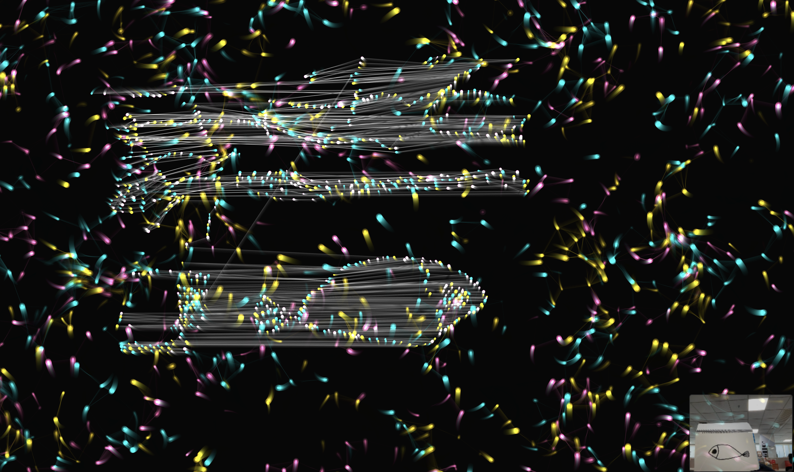

# teamlab-web-mvp

teamLab 风格实时交互粒子艺术生成器。



## 功能
- 1500 发光粒子实时漂移
- 鼠标/触摸/摄像头体感交互
- 涟漪波动场、粒子连线、流动场、Bloom 辉光
- 扫描涂鸦生成游动粒子角色

## 技术栈
p5.js + HTML5 Canvas + MediaPipe Hands

## 运行
```bash
python3 -m http.server 3000
# 访问 http://localhost:3000
```

## 交互
- **鼠标移动**：排斥粒子
- **点击**：产生涟漪
- **摄像头**：举手进入体感，双手靠近吸引
- **空格**：扫描涂鸦生成角色

## 已知限制
- 需 localhost/HTTPS 运行（摄像头权限）
- 首次加载 MediaPipe 需 5-10 秒
- 低端设备自动降级粒子数/Bloom/流动场分辨率

## Credits

- **smapdhpd-beep**：项目发起、设计决策、视觉调优、交互验收
- **Claude (Anthropic)**：代码实现、架构设计、性能优化、文档归档
